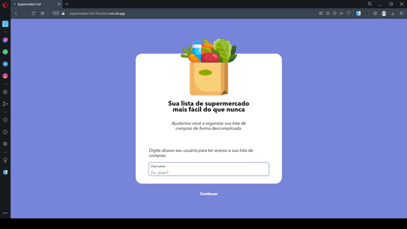

# Supermarket List App

This is an application build using React.js, with the goal of make easier create supermarket lists.

<p>
  
</p>

## Link to Production App:

https://supermarket-list-frontend.vercel.app

## Technologies Used

- React.js
- CSS
- Axios

## Requirements to Run:

- Node.js (https://nodejs.org/en/)

## Running Instructions

1. Clone the project:

```
 git clone https://github.com/Willchagas/supermarket-list-frontend
```

2. Install the dependecies:

```
 cd supermarket-list-frontend && npm install
```

3. Run the project:

```
 npm start
```

4. (Optional) If you want build a production version:

```
npm build
```
